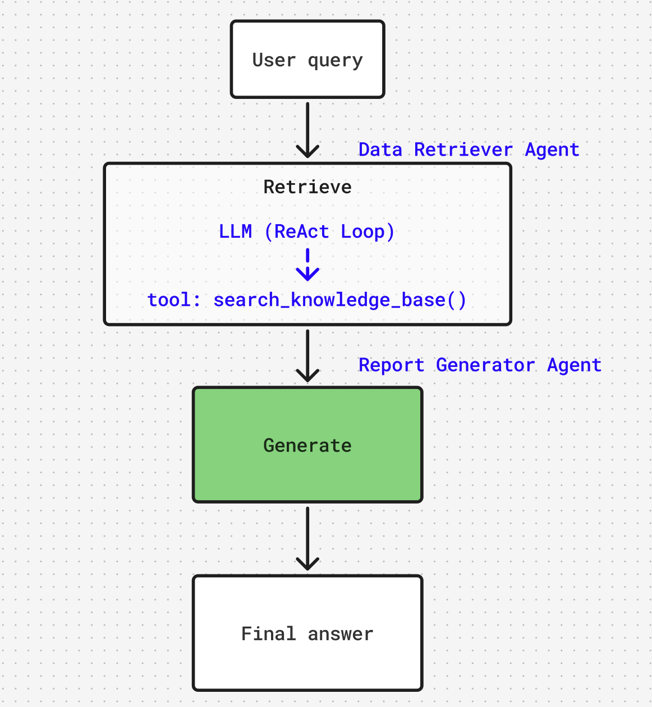
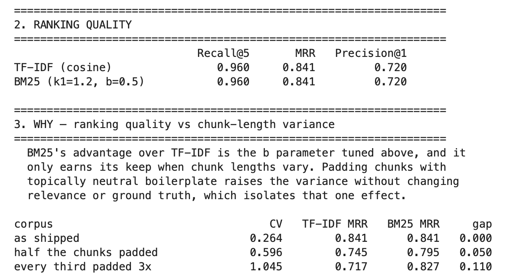
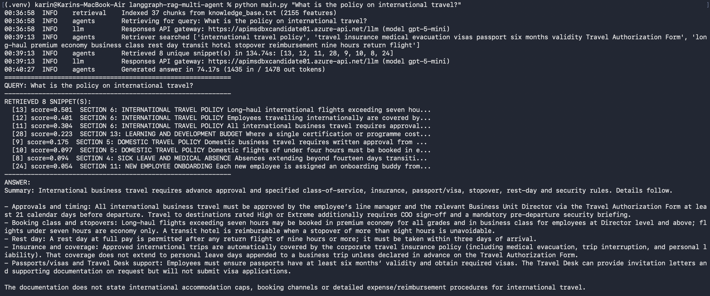
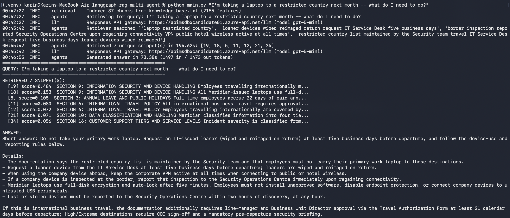
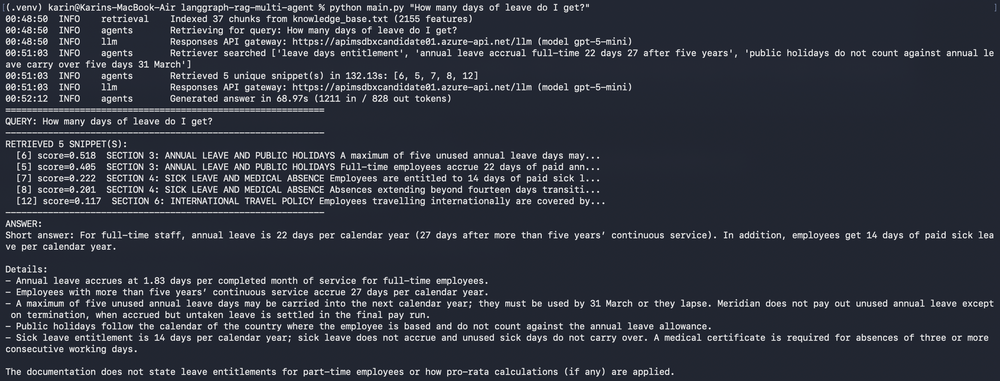
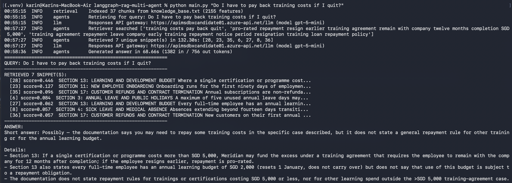
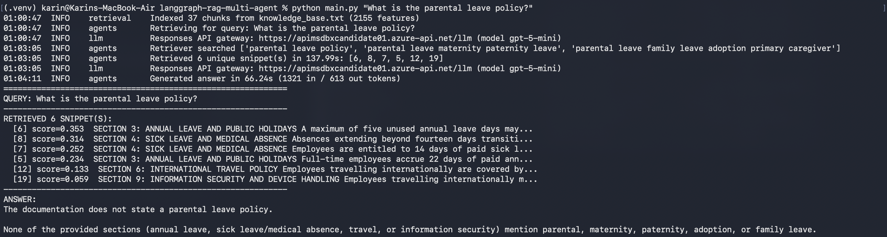

# LangGraph Multi-Agent RAG

A minimal retrieval-augmented generation pipeline built on **LangGraph**, answering questions from a local knowledge base using two agents in sequence.

The knowledge base (`knowledge_base.txt`) is a fictional employee handbook for "Meridian
Data Solutions" — HR policy, travel and expense rules, information security, and product
reference, in 17 sections.



## Requirements

- **Python 3.11+** (scikit-learn 1.9 sets this floor)
- An **Azure OpenAI** deployment — only for the live end-to-end run


## Install

```bash
# 1. from the project root, create and activate a virtual environment
python3 -m venv .venv
source .venv/bin/activate          # Windows: .venv\Scripts\activate

# 2. install the dependencies
pip install -r requirements.txt
```

That installs five packages:

| Package | Why |
| --- | --- |
| `langgraph` | graph orchestration and the prebuilt ReAct agent |
| `langchain-core` | message types and the `@tool` decorator |
| `langchain-openai` | Azure OpenAI chat client |
| `scikit-learn` | TF-IDF vectoriser and cosine similarity for retrieval |
| `python-dotenv` | loads credentials from `.env` |


## Configure credentials

Copy the example file and fill in your endpoint and key:

```bash
cp .env.example .env
```

```ini
AZURE_OPENAI_ENDPOINT=<your-resource>
AZURE_OPENAI_API_KEY=<your-key>
AZURE_OPENAI_DEPLOYMENT=gpt-5-mini
AZURE_OPENAI_API_VERSION=2024-12-01-preview

# Leave unset for gpt-5 models, which only accept the default temperature
# LLM_TEMPERATURE=0

# Reasoning effort for the Data Retriever only (default: minimal)
# RETRIEVER_REASONING_EFFORT=minimal
```


## Run

```bash
# ask one question
python main.py "What is the policy on international travel?"

# omit the question to run the five built-in sample queries
python main.py

# add -v for the full debug trace: every search phrase, every score
python main.py -v "How many days of leave do I get?"
```


## Project Layout

| File | Role |
| --- | --- |
| `main.py` | CLI entry point, output formatting, per-query error handling |
| `orchestrator.py` | builds and caches the LangGraph workflow |
| `state.py` | `RAGState` — the typed state passed between agents |
| `agents.py` | the two graph nodes, snippet harvesting and deduplication |
| `retrieval.py` | chunking, TF-IDF index, `search_knowledge_base` tool |
| `llm.py` | Azure OpenAI client construction and credential validation |
| `log_config.py` | logging setup, quietens the HTTP libraries |
| `prompts/` | agent instructions as `.md`, loaded by `prompts/__init__.py` |
| `knowledge_base.txt` | the knowledge base |
| `evaluation.ipynb` | Evaluation between TF-IDF and BM25 |

Prompts are kept as Markdown files rather than string literals so they can be edited and
reviewed as prose — prompt design is a substantial part of this system's behaviour.


## Sample queries

`main.py` runs these when given no argument:

1. `What is the policy on international travel?`
2. `I'm taking a laptop to a restricted country next month -- what do I need to do?`
3. `How many days of leave do I get?`
4. `Do I have to pay back training costs if I quit?`
5. `What is the parental leave policy?`

The last one is deliberate: the handbook has no parental leave policy. Retrieval returns
adjacent leave sections, and the generator is expected to say the handbook does not cover
it rather than improvise an answer from the annual and sick leave rules.


## Why select TF-IDF over BM25


Both were benchmarked on 25 labelled questions. BM25 was tuned first across 20 combinations of k1 and b so the comparison used it at its best.

1. Ranking quality is identical — Recall@5 0.960, MRR 0.841, Precision@1 0.720 for both. No BM25 setting beat TF-IDF.
2. The tie is caused by uniform chunk length. BM25's advantage is its length-normalisation parameter b, which only helps when chunk lengths vary. This corpus is 37 similarly-sized paragraphs (coefficient of variation 0.264), so there is nothing for b to correct. Artificially making the lengths uneven does break the tie: at CV 0.60 BM25 leads by 0.050 MRR, and at CV 1.05 by 0.110. Making chunks uniformly longer does not help BM25 — only unevenness does.
3. With ranking equal, cost decides. TF-IDF is two scikit-learn calls against a dependency the project already has; BM25 required hand-rolling a scorer.

Boundary: above roughly CV 0.5 — a corpus mixing short notes with long documents — this decision should be revisited.


## Final Output
1. `What is the policy on international travel?`


2. `I'm taking a laptop to a restricted country next month -- what do I need to do?`


3. `How many days of leave do I get?` (Ambiguous questions)


4. `Do I have to pay back training costs if I quit?`


5. `What is the parental leave policy?` (Negative Test)
